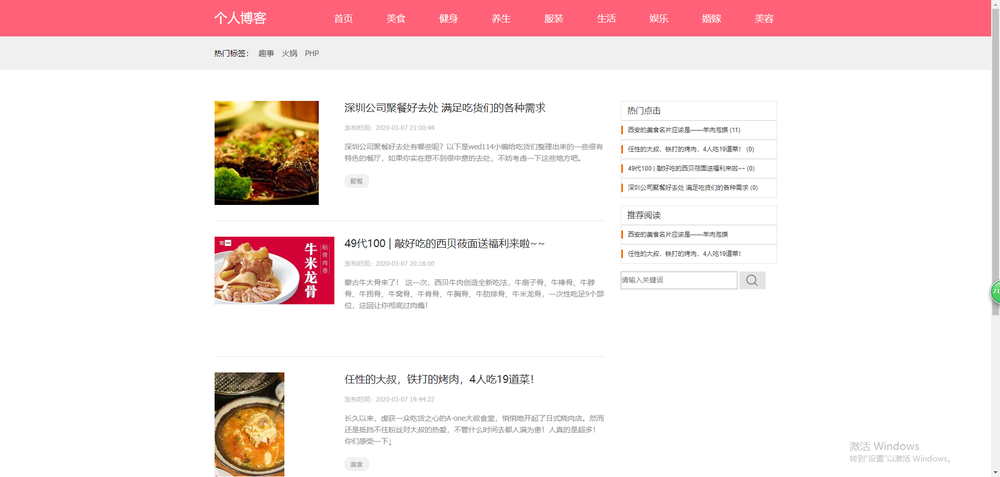

# 博客管理系统

一个 基于PHP 的 博客管理系统

## 更新

- 暂无

## 使用

- 下载源码

- 修改config.php中base_url配置

- 添加我的微信（yangyang92428）捐赠获取数据库

## 界面

具体设计可查看我的博客：[PHP + CI框架 + AdminLite博客管理系统](https://www.cnblogs.com/yang-2018/p/12455805.html)
